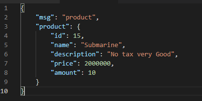
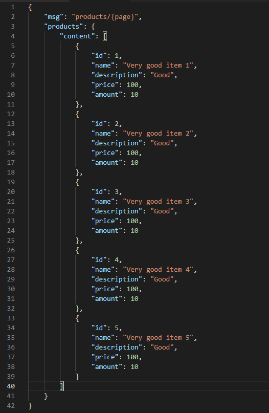
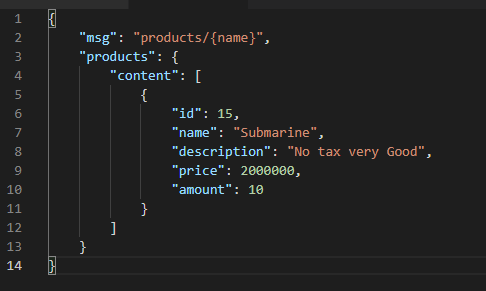
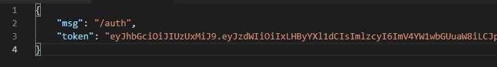
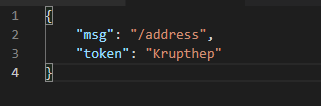
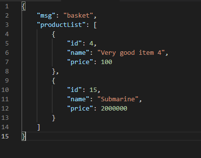
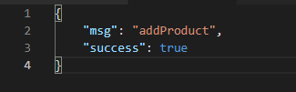
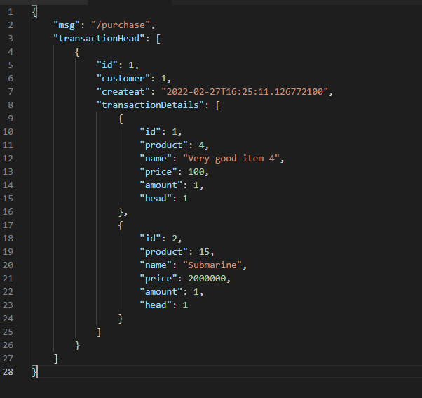
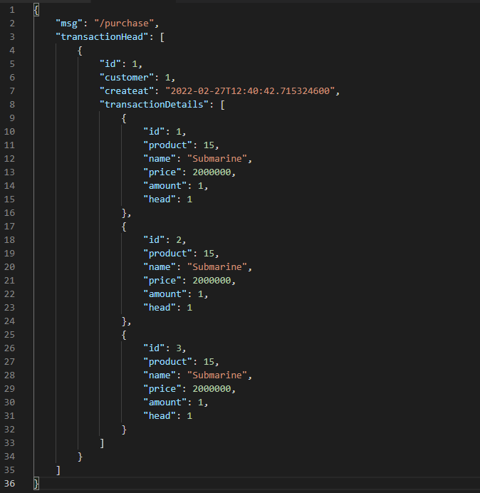

Version 1.0.0

# Summary Assignment Workshop
- Flow การทำงาน Controller > Service > Repository
- Validate JWT Token สำหรับบาง API (Implement ในระดับ Filter ไม่เสร็จ ตอนนี้ทำในระดับ Service)
- Connect to Public API สำเร็จจำลองข้อมูลเงินใน Wallet
- Test แค่ระดับ DataJPA

# Prerequisites for testing
* Internet connection สำหรับดึงค่าเงินจาก public API
* Java 11
* Spring boot 2.6.4

# Scenario

* [X] User กดเรียกดูสินค้า โดยระบบจะแสดงสินค้าหน้าละ 5 ชิ้น
* [X] User กดดูสินค้าหน้าที่ 2
* [X] User ไม่เจอสินค้าที่ต้องการ เลยทำการค้นหาสินค้าจากชื่อ โดยใส่คำว่า Submarine
* [X] System แสดงสินค้าที่ชื่อว่า Submarine (ชื่อ ราคา คำอธิบาย)
* [X] User ทำการหยิบสินค้าชิ้นนี้ใส่ตะกร้า แต่ระบบบังคับให้เข้าสู่ระบบ
* [X] (User ทำการเข้าระบบ)
* [X] User ทำการหยิบสินค้าชิ้นนี้ใส่ตะกร้า
* [X] User กดสั่งซื้อสินค้า และ System แสดงรายละเอียดสินค้าในตะกร้า (ชื่อ ราคา)
* [ ] User เลือกที่อยู่จัดส่งจากใน Platform หรือ กรอกใหม่เอง
* [X] User เลือกจ่ายด้วย External Wallet address และ ยืนยันการสั่งซื้อ (System ทำการตัดเงินและ Stock) และระบบจะแสดงใบเสร็จ

# API List

Endpoint  | METHOD       | Path | Description | Sample Valid Request Body | Sample Valid Response Body |
------------- |--------------|------|-------------|-----------------------|---------------------------|
Product  | GET | /product  | ดึง Product 1 ชิ้น| [QueryParams](#product-req) | [JSON](#product-res)
Product  | GET | /products  | ดึง Product ทีละ 5 ชิ้น| [QueryParams](#product-page-req) | [JSON](#product-page-res)
Product  | GET | /products/by  | ดึง Product ทีละ 5 ชิ้น ตามชื่อ Product| [QueryParams](#product-page-by-name-req) | [JSON](#product-page-by-name-res)
Customer  | POST | /auth  | สำหรับดึง JWTToken| [JSON](#auth-req) | [JSON](#auth-res)
Customer  | GET | /address  | สำหรับดึง User Address | [QueryParams](#address-req) | [JSON](#address-res)
BasketProduct  | GET | /basket  | สำหรับดึงข้อมูลตะกร้าสินค้า| [QueryParams](#basket-req) | [JSON](#basket-res)
BasketProduct  | POST | /addProduct  | เพิ่มสินค้าลงตะกร้า | [JSON](#addProduct-req) | [JSON](#addProduct-res)
Transaction  | GET | /purchase  | สำหรับดึงข้อมูล Transaction ที่สำเร็จแล้ว | [QueryParams](#purchase-get-req) | [JSON](#purchase-get-res)
Transaction  | POST | /purchase  | ยืนยันการสั่งซื้อสินค้าที่อยู่ในตะกร้า (BasketProduct      ) | [JSON](#purchase-tx-req) | [JSON](#purchase-tx-res)

# Request Body

### product-req 
[GET] api/v1/product
> ?id={INTEGER}

 

### product-page-req 
[GET] api/v1/product
> ?page={INTEGER}

 

### product-page-by-name-req 
[GET] api/v1/product
> ?page={INTEGER}
> &name={PRODUCT_NAME}

 

### auth-req
[POST] api/v1/auth

>  { 
>  &nbsp;&nbsp;&nbsp;&nbsp;"username": "prayut", 
>  &nbsp;&nbsp;&nbsp;&nbsp;"password": "P@ssw0rd1" 
>  }

 

### address-req
[GET] api/v1/address
> ?token={JWT_TOKEN}

 

### basket-req
[GET] api/v1/basket
> ?token={JWT_TOKEN}

 

### addProduct-req
[POST] api/v1/addProduct

>  { 
>  &nbsp;&nbsp;&nbsp;&nbsp;"product": {PRODUCT_ID}, 
>  &nbsp;&nbsp;&nbsp;&nbsp;"customer": {CUSTOMER_ID} 
>  &nbsp;&nbsp;&nbsp;&nbsp;"token": {JWT_TOKEN} 
>  }

 

### purchase-get-req
[GET] api/v1/purchase
> ?token={JWT_TOKEN}

 

### purchase-tx-req
[POST] api/v1/purchase

>  { 
>  &nbsp;&nbsp;&nbsp;&nbsp;"token": {JWT_TOKEN} 
>  }

 

# Response Body

### product-res 
[GET] api/v1/product

 

### product-page-res 
[GET] api/v1/products

 

### product-page-by-name-res 
[GET] api/v1/products/by

 

### auth-res
[POST] api/v1/auth

 

### address-res
[GET] api/v1/address

 

### basket-res
[GET] api/v1/basket

 

### addProduct-res
[POST] api/v1/addProduct

 

### purchase-get-res
[GET] api/v1/purchase

 

### purchase-tx-res
[POST] api/v1/purchase

